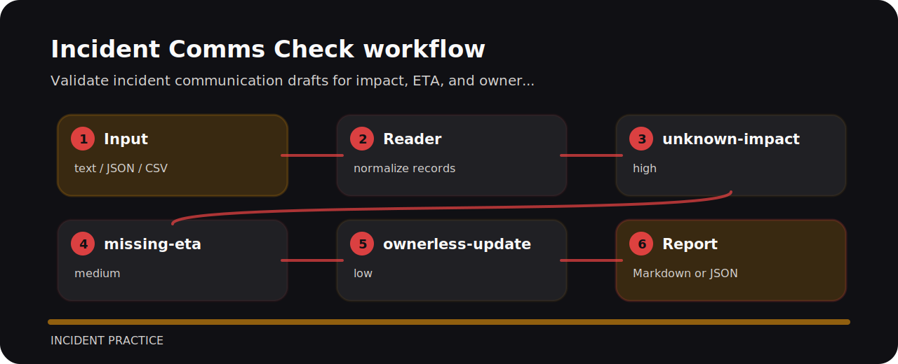

# Incident Comms Check


Incident Comms Check is meant for quick pull-request checks around incident response. It favors explicit rules over a bulky dashboard.

## What gets flagged

| Signal | Level | What it flags | Fix direction |
| --- | --- | --- | --- |
| `unknown-impact` | high | impact is not clear | state affected users, tenants, or functions |
| `missing-eta` | medium | ETA is missing | provide next update time or recovery estimate |
| `ownerless-update` | low | communication owner is missing | assign a comms owner |

## Example lines

```text
risky: incident update impact unknown eta missing owner none
clean: incident update impact 420 users eta 30m owner support-lead
```

## One-pass run

```bash
git clone https://github.com/mertefekurt/incident-comms-check.git
cd incident-comms-check
python -m pip install -e ".[dev]"
incident-comms-check examples/sample.txt
```

## Finding map


